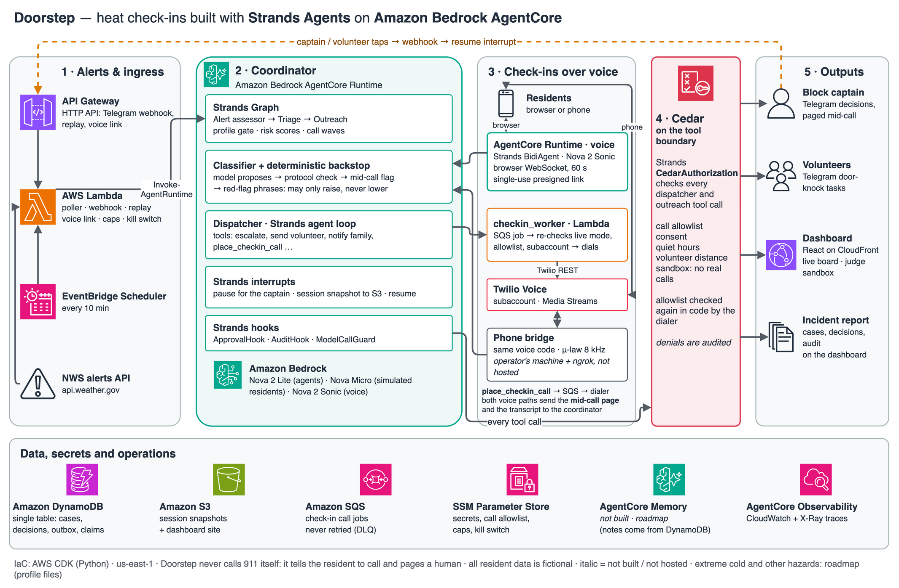

# Doorstep

**When a heat warning hits, Doorstep phones every at-risk neighbour on a volunteer group's list, sorts who is OK from who isn't, sends a volunteer to the doors that need a knock, and interrupts the block captain only for the decisions a human must make.**

Built with the **Strands Agents SDK** and deployed on **Amazon Bedrock AgentCore**, for the AWS "Agents for Humans" hackathon (Good Neighbor track).

[](https://github.com/anshsahny/doorstep/actions/workflows/ci.yml) [](LICENSE)

> All resident data in this repository, the demo and the video is **fictional**. The one real input is the archived, public-domain NWS Portland Excessive Heat Warning of June 2021. Doorstep never calls emergency services: it tells the resident to call 911 and pages a human.

## The problem, and who it's for

In the 2021 heat dome the BC Coroners Service confirmed **619** heat-related deaths. **98%** died indoors, **56%** lived alone and **67%** were 70 or older. The coroner's review asked for extreme-heat alerts to be paired with clear protocols, and for people who live alone to be prioritised for check-ins ([CBC](https://www.cbc.ca/news/canada/british-columbia/bc-heat-dome-coroners-report-1.6480026), [review panel report](https://www2.gov.bc.ca/assets/gov/birth-adoption-death-marriage-and-divorce/deaths/coroners-service/death-review-panel/extreme_heat_death_review_panel_report.pdf)).

Neighbourhood teams already keep lists of the people most at risk. What doesn't scale is one volunteer captain, with a day job, working through a phone tree on a hot afternoon. Doorstep is for that captain.

## Demo

- **Live dashboard and judge sandbox:** https://d3fia1jq6liv5t.cloudfront.net. Click **Run a drill** to get your own incident with 12 fictional residents, then **Answer a call** to talk to Doorstep as a resident in your browser. Try saying you feel dizzy. The sandbox never places real calls or sends Telegram messages, and it has per-visitor and daily caps.
- **Video:** link on the Devpost submission.
- **Evaluation report:** [`evals/REPORT.md`](evals/REPORT.md).

**60-second tour.** The real 2021 warning arrives → a Strands Graph decides whether the profile activates and ranks residents into call waves → Doorstep calls each resident (Nova 2 Sonic voice, or text in drills) → a classifier plus deterministic backstops sort OK, needs help and urgent → a dispatcher agent acts through Cedar-guarded tools → a red flag pauses the agent with a Strands interrupt and pages the captain on Telegram, *while the resident is still on the line* → the captain taps "Send Tom" → the paused agent resumes, possibly in another process → Tom taps "They're OK" → the incident report shows every step.

## How it works



Source: [`docs/architecture.drawio`](docs/architecture.drawio), generated by [`scripts/gen_architecture.py`](scripts/gen_architecture.py). Italic labels mark what is not built or not hosted.

**The model proposes, deterministic code decides.** Agents choose what help fits and write the reasons. Code owns state transitions, disclosure and the captain's choices, and Cedar decides whether a tool call may happen at all.

### The decisions a human makes

The captain is interrupted only for:

| Decision | When | Options |
|---|---|---|
| Urgent red flag | Dizziness, confusion, chest pain, trouble breathing, cannot get up, or the hazard's own red flags; raised **mid-call** | I'm handling it · Send nearest volunteer · Call the family contact (with consent) |
| High-risk resident not reached | 3 unanswered or unclear attempts | Approve a door-knock · I'm handling it · Family contact |
| Door-knock approval | A high-risk resident's details would leave the building | Send the volunteer · I'm handling it |
| Unmet need | Nobody available nearby | I'm handling it · … |

One decision per resident. Volunteers get **tasks**, not decisions ("On my way", "They're OK", "Need more help"), carrying only what they need: first name (with consent), address and standing notes such as "hard of hearing", never the resident's words from the call.

### Every hazard is a profile

Nothing hazard-specific is in the code. [`profiles/heat.yaml`](agent/doorstep_agent/profiles/heat.yaml) holds the NWS alert names, risk weights, questions, red-flag phrases (English and Spanish), needs, relief-centre kind and script lines; a test fails if a hazard word appears anywhere else in the agent package. Heat is built and tested. Extreme cold, smoke and power shutoffs are **roadmap** profiles, not built.

## How Doorstep uses Strands Agents

| Strands feature | Where | What it does here |
|---|---|---|
| `Agent` + tools (`@tool(context=True)`) | [`agents/dispatcher.py`](agent/doorstep_agent/agents/dispatcher.py), [`tools.py`](agent/doorstep_agent/tools.py) | The dispatcher acts on each result with 13 tools |
| **Graph** multi-agent pipeline | [`graph.py`](agent/doorstep_agent/graph.py) | Alert assessor → triage → deterministic outreach node |
| **Structured output** | [`agents/classifier.py`](agent/doorstep_agent/agents/classifier.py), [`agents/alert_assessor.py`](agent/doorstep_agent/agents/alert_assessor.py), [`agents/triage.py`](agent/doorstep_agent/agents/triage.py) | Typed check-in results, alert assessments and call plans |
| **Interrupts** (tool and hook) | `escalate_to_captain` in [`tools.py`](agent/doorstep_agent/tools.py); [`approvals.py`](agent/doorstep_agent/approvals.py) | A tool interrupt pages the captain; a `BeforeToolCallEvent` interrupt stops a door-knock before any detail leaves |
| **Session management** | [`sessions.py`](agent/doorstep_agent/sessions.py) | `SnapshotSessionManager` on S3: a paused case resumes in another AgentCore process ([restart test](tests/test_restart_resume.py)) |
| **Cedar authorization** | [`policies.py`](agent/doorstep_agent/policies.py), [`agent/policies/*.cedar`](agent/policies) | Allowlisted real calls only, quiet hours, consent, volunteer distance, no broadcast of details, no agent-recorded emergency calls, sandbox never reaches a real channel |
| **Hooks** | [`audit.py`](agent/doorstep_agent/audit.py), [`guards.py`](agent/doorstep_agent/guards.py) | Every tool call and denial audited with the deciding facts; runaway model loops cut off |
| **BidiAgent** (experimental bidi) on Nova 2 Sonic | [`voice/doorstep_voice/session.py`](voice/doorstep_voice/session.py), [`phone.py`](voice/doorstep_voice/phone.py) | Speech-to-speech check-ins in the browser and over Twilio Media Streams, with barge-in and a mid-call page |
| **Strands Evals** | [`evals/`](evals), [`agents/persona.py`](agent/doorstep_agent/agents/persona.py) | `ActorSimulator` residents, `Experiment`/`Case` suites with deterministic evaluators |
| OpenTelemetry | [`cloud/entrypoint.py`](agent/doorstep_agent/cloud/entrypoint.py) | Spans to AgentCore Observability |

## AWS services and why

| Service | Why |
|---|---|
| **Amazon Bedrock AgentCore Runtime** | Hosts the coordinator (long-running incidents, pause and resume across processes) and the browser voice agent (WebSocket with presigned, single-use links) |
| **AgentCore Observability** | Traces for every agent, model and tool call (`make trace`) |
| **Amazon Bedrock** | Nova 2 Lite (agents), Nova 2 Sonic (voice), Nova Micro (simulated residents) |
| AWS Lambda + API Gateway HTTP API | Telegram webhook, dashboard API, drill replay, voice links, the call dialer; every public route throttled |
| Amazon DynamoDB | One table: incidents, cases, decisions, outbox, idempotency claims |
| Amazon S3 + CloudFront | Session snapshots; the dashboard |
| Amazon SQS | Real call jobs, never retried (dead-letter queue with an alarm) |
| EventBridge Scheduler | NWS alert poller every 10 minutes |
| SSM Parameter Store | Secrets (SecureString), call allowlist, caps, kill switch |
| AWS CDK (Python) | One stack: [`infra/doorstep_stack.py`](infra/doorstep_stack.py) |

Not built: AgentCore Memory (resident notes come from the roster in DynamoDB), AgentCore Gateway/Policy. The phone bridge runs on the operator's machine behind ngrok; it is not hosted, so real phone calls only work while it runs.

## Safety and privacy

- **Never replaces 911.** The agent tells the resident to call and pages a human; Cedar forbids an agent from recording an emergency call.
- **Real calls only to allowlisted, consenting residents**, enforced by Cedar *and* by a code check in the dialer, which also refuses anything but the Twilio subaccount.
- **Minimal disclosure:** group broadcasts cannot carry resident details (Cedar plus a text check); volunteer briefs carry only consented standing facts.
- **Opt-in roster only**, fictional in this repo. Health details are kept to things like "needs power for a medical device": no diagnoses, no medications.
- **Public sandbox:** its own incident, no real channels (Cedar `sandbox_never_real_channels` plus code), per-IP and daily and total caps, a passcode lockout, and a kill switch.
- **No secrets in the repo:** gitleaks runs pre-commit and in CI over the full history; deployed secrets live in SSM and are read into memory; `make scan-logs` searches logs and spans for any secret value.

## Evidence

From [`evals/REPORT.md`](evals/REPORT.md) (Strands Evals, Nova models, fictional residents):

| Measure | Result |
|---|---|
| Red-flag recall over 30 urgent check-ins (10 personas × 3) | **90.0%** (target 100%, not met). All three misses were calls where the simulated resident never said the red flag |
| Red team: forbidden attempts denied with an audit reason | **20/20**, 0 forbidden effects |
| Policy violations across all suites | **0** |
| Dispatcher trajectories (12 scenarios × 2) | **24/24** (12/22 before the fixes the evals prompted) |
| June 2021 replay, 48 residents: alert → first call | **7 s** (plus up to 10 min poller interval) |
| June 2021 replay: all 48 reached or escalated | **27.9 min** projected on 6 phone lines vs ≈ 3.2 h for a one-volunteer phone tree |
| June 2021 replay: human decisions vs automated actions | **18 vs 204** |

Earlier gates (drills in the cloud, restart and resume, real phone calls with a mid-call page, Lighthouse accessibility 100) are recorded in [`docs/PROGRESS.md`](docs/PROGRESS.md).

## Quickstart

**Requirements:** Python 3.12 via [uv](https://docs.astral.sh/uv/), Node 22 (on your `PATH`; the Makefile also looks in `/opt/homebrew/opt/node@22/bin`), git, and for the model-backed steps an AWS account with Amazon Bedrock access to Nova 2 Lite and Nova Micro in `us-east-1`.

```bash
git clone https://github.com/anshsahny/doorstep.git
cd doorstep
make setup            # Python 3.12 + deps, pre-commit hooks, npm install
make check            # ruff + unit tests: offline, no AWS needed
make web-test         # dashboard typecheck and tests
```

**A local drill** (no deploy, no calls, no Telegram; about $0.40 of Bedrock tokens). Use any AWS credentials that can call Bedrock: a CLI profile named `doorstep`, or your own via `AWS_PROFILE`.

```bash
cp .env.example .env  # optional locally: model ids and region have defaults
AWS_PROFILE=your-profile make local-drill ARGS=--auto-approve
```

You'll see a live terminal board: the 2021 warning activates the heat profile, 12 fictional residents are called by simulated personas, urgent ones are escalated, and the simulated captain answers. Exit code 0 means every case settled, both urgent personas were escalated, and there were 0 policy violations.

**Evals** (about $2 of Bedrock tokens; `ARGS=--report` rebuilds the report from saved results for $0):

```bash
make evals
```

### Full deploy (optional)

Needs Docker (arm64 builds), a CDK-bootstrapped account (`npx cdk bootstrap`), a Telegram bot, and for real calls a Twilio **subaccount**.

```bash
cp .env.example .env          # fill in Telegram, Twilio subaccount, allowlist
make secrets-push ARGS=--generate-missing   # .env → SSM SecureStrings (names only printed)
make deploy                   # one CDK stack, then seeds the fictional roster
make telegram-webhook ARGS=set
make cloud-drill ARGS=--auto-approve
make web-deploy               # dashboard to S3 + CloudFront
```

Use `make deploy AWS_PROFILE=yours` if your profile isn't called `doorstep`. `make destroy` tears the stack down (SSM parameters are kept). Every command is listed in [`CLAUDE.md`](CLAUDE.md#commands-keep-this-list-current) and `make help`.

## Configuration and cost

Configuration is in [`.env.example`](.env.example) (local) and SSM Parameter Store (deployed): model ids, Twilio subaccount, Telegram, the call allowlist, caps and the kill switch.

Costs are tallied in [`docs/COST.md`](docs/COST.md). Roughly: a 12-resident drill is about $0.37 of Nova 2 Lite tokens; a one-minute voice call about $0.013 of Nova 2 Sonic; nothing runs continuously at meaningful cost. The public sandbox is capped at 15 drills a day and 120 in total.

## Judging criteria map

| Criterion | Where to look |
|---|---|
| Technical implementation | The Strands table above; AgentCore Runtime deploy ([`infra/`](infra)); [`tests/`](tests) (about 400 offline tests) and CI; [`evals/REPORT.md`](evals/REPORT.md) |
| Design | The live dashboard and judge sandbox; the phone and Telegram loop; the incident report; accessibility (Lighthouse 100) |
| Potential impact | The coroner-backed problem; a specific user (the block captain); the 2021 replay against a phone tree |
| Creativity | An agent triggered by the real world that phones people; mid-call paging; minimal-disclosure briefs; "model proposes, policy decides"; hazard profiles |
| Presentation | The video; this README; the evaluation report with before-and-after numbers |

## Limitations

- **Recall is 90%, not 100%**, in simulation. A resident who downplays how they feel and is never asked a direct red-flag question can be missed; a direct screening question is the next change.
- Simulated residents are Nova Micro role-play, not people; a real pilot is the only true test.
- The 27.9-minute replay figure is a projection from real call lengths, not a phone day.
- The phone bridge is not hosted; only the browser voice path and the dashboard are live for judges.
- English and Spanish only; US numbers and NWS alerts only.
- Model wording still sometimes promises timing ("someone will be with you soon") or refuses awkwardly on an urgent call; measured in the report.

## Roadmap

- Pilots with a senior building and a neighbourhood emergency team
- Canadian alerts (Environment and Climate Change Canada)
- More hazard profiles: extreme cold, wildfire smoke, power shutoffs (each a profile file)
- A direct red-flag screening question; AgentCore Memory for resident preferences
- Opt-in enrolment by phone

## Disclosures

- **Built during the submission period** (Aug 10 – Sep 14, 2026). No pre-existing project code.
- **AI coding assistant:** Claude Code was used throughout.
- **Adapted samples:** `scripts/smoke/03_agentcore_hello/` uses scaffolding generated by `agentcore create` (npm `@aws/agentcore` 0.28.1, Apache-2.0, https://github.com/aws/agentcore-cli); it is gitignored and regenerated. Smoke scripts follow usage patterns from the [Strands docs](https://strandsagents.com/docs/) and [Twilio Media Streams docs](https://www.twilio.com/docs/voice/media-streams); no sample code was copied.
- **Data:** the June 2021 NWS Portland Excessive Heat Warning comes from the [Iowa Environmental Mesonet VTEC archive](https://mesonet.agron.iastate.edu/vtec/?year=2021&wfo=KPQR&phenomena=EH&significance=W&eventid=0001) (public domain). Relief centres are real public places labelled "sample – verify". Every resident, volunteer and persona is invented.

## License

[MIT](LICENSE)
